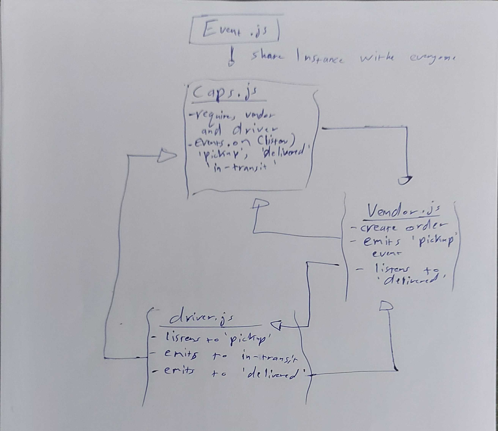

# LAB - 18

## Event Driven Applications

### Author: Ammar Badwan

### Links and Resources

- [Pull Request](https://github.com/ammarBadwan-401-advanced-javascript/caps/pull/3)
- [GitHub Actions CI](https://github.com/ammarBadwan-401-advanced-javascript/caps/actions)

### Modules

#### Events modules
* `./event.js`
* `./caps.js`
* `./driver.js`
* `./vendor.js`

#### Socket.io Modules (they require npm i before working)
* `./driver/driver.js`
* `./CAPS/caps.js`
* `./vendor/vendor.js`

### How to initialize the application

* Start by running `caps.js` module, then run `vendor.js` module, lastly run `driver.js` module, all those modules are inside their similarly named folders and **NOT** the ones in the main directory.

### Tests

* Lint test: `npm run lint`.
* Unit test: `npm test`.

### UML 

